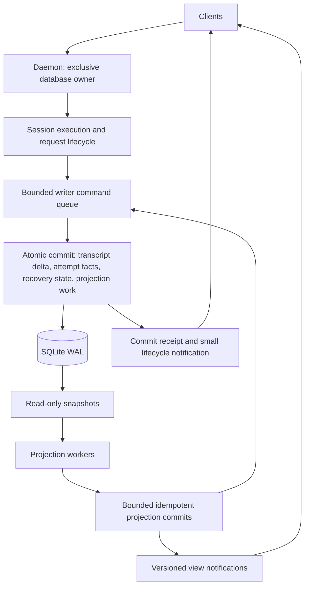

# 0236. Durable turn commits and recoverable projections

- **Status:** Proposed
- **Date:** 2026-09-11
- **Scope:** Agent turn lifecycle, daemon ownership, persistence, usage accounting, and frontend completion delivery
- **Deciders:** Pending maintainer review
- **Builds on:** ADR-0048, ADR-0186, ADR-0187, ADR-0196, ADR-0209, ADR-0231, ADR-0232
- **Proposed amendments:** ADR-0122's usage storage and settlement mechanism; ADR-0231's database ownership and reader construction; ADR-0209's delivery of derived usage views

## Context and Problem Statement

A model stream ending does not mean that Muta has finished the local work needed to complete a turn. Accounting, persistence, request estimation, and frontend event delivery can extend the visible `finalizing response` phase. A shared writer actor orders database commands, but does not make expensive commands cheap, make caller-side read/modify/write atomic, or establish exclusive ownership across processes.

The investigation established distinct issues that must not be conflated:

- ADR-0231 records historical writes that bypassed the actor and encountered SQLite lock contention. Historical log messages alone do not establish that a currently running binary still has those paths.
- Synchronous acknowledgement waits can keep a turn waiting even when every SQL mutation uses the actor correctly.
- Usage settlement reads, merges, and rewrites a whole daily JSON bucket. A local read-only inspection found a largest bucket of approximately 5.7 MB; this is workload evidence, not a portable benchmark.
- Reading a bucket outside the actor and enqueuing only its replacement can lose concurrent updates. Serial writes alone do not protect the operation.
- The current reader factory opens the general database engine, which also configures and checks migrations. A reader should not have schema-writing responsibilities.
- Repeated request assembly and display estimates add CPU work to turn boundaries independently of SQLite.

The local fixes that enqueue usage settlement, merge within a transaction, and remove a duplicate estimate are intermediate improvements. They do not remove daily-bucket rewrite costs from the shared writer queue. This proposal defines the target rather than declaring those fixes a completed architecture.

This decision crosses storage, agent lifecycle, recovery, and frontend boundaries; changing it later would require data and protocol migrations. It therefore establishes binding architectural boundaries upon acceptance. It is not a proposal to rewrite unrelated tools, providers, or UI components.

## Decision Drivers

- Predictable local completion latency under concurrent sessions and growing history.
- Crash recovery that preserves acknowledged messages and request accounting.
- Accurate usage history that survives session deletion.
- One explicit database owner, short transactions, and enforceable read/write boundaries.
- Background work that is bounded, observable, and recoverable rather than silently dropped.
- Compatibility with the daemon authority, incremental transcript storage, and notification-driven clients already adopted.
- A migration that can be interrupted safely and verified before cutover.

## Considered Options

1. Keep SQLite and one writer, but redesign ownership, atomic commands, usage storage, and projection recovery.
2. Keep daily JSON buckets and move their writes to a background queue.
3. Add independent writers or databases for each subsystem.
4. Route reads and writes through one universal actor.
5. Replace persistence with universal event sourcing or an external database and message broker.

## Decision Outcome

Proposed choice: **Option 1**. Keep the existing embedded database and incremental transcript model. Commit the minimum authoritative facts at explicit lifecycle boundaries; derive expensive views asynchronously from those facts with durable progress.

The names below describe responsibilities and proposed contracts, not APIs already implemented.

### D1. One owner per database, across processes

The daemon owns the production database. Normal clients use the daemon protocol; they do not open a competing writer. Before opening a writable connection or running migrations, the daemon acquires an operating-system-managed exclusive lock associated with the database identity and retains it until its writer has stopped.

Ownership must account for canonical paths and reject unsupported aliasing arrangements, including hard-linked database files. A PID file is diagnostic metadata, not the lock. A second starter either connects to the established owner or returns a clear ownership error. It must not silently fall back to opening another writer.

This proposal does not reintroduce a standalone client architecture. If an existing offline maintenance or embedded mode must write the same database, it must acquire the same ownership lease while the daemon is absent and use the same persistence service. Tests may own separate temporary databases. Within one owner, handle construction must reuse the registered writer for a database identity rather than spawning another one.

The contract covers supported local filesystems and cooperating application processes. It does not claim to fence an arbitrary external SQLite client. External contention remains a diagnosed failure, not a justification for dropping records or starting a replacement writer. Remote/shared-filesystem databases are outside this deployment contract.

### D2. Initialization belongs to the owner; readers are read-only

Startup proceeds in this order: acquire ownership, open the writer, validate or migrate the schema, initialize recovery, then admit client mutations. Concurrent startup must not create simultaneous migration authorities. A supervisor restart retains ownership; it must confirm the previous writer has exited before opening its replacement.

`DbReader` uses an actual read-only connection. It neither creates a database nor runs migrations or legacy imports. Readers are leased from a bounded pool, with one explicit read transaction when a report requires a consistent snapshot. Long reports must release snapshots between bounded work units where consistency permits; monitor snapshot age and WAL growth.

Read-only queries run off the async executor. Readers may report schema incompatibility or owner unavailability, but cannot repair it. A corrupt source is an explicit diagnostic, not an empty-success result.

### D3. Commit business operations, not caller-computed replacements

The writer accepts typed domain commands. A turn commit carries:

- An idempotency key, session identity, and expected session generation/revision.
- Only new transcript entries or explicitly requested context directives.
- New or strengthened request-attempt facts.
- The recovery cursor, retry/interrupt state, and other state required to resume this boundary.
- Durable work markers for projections affected by the commit.

The writer validates the expected revision and applies the operation in one transaction. Replaying the same operation returns its original receipt; a different operation against a stale revision is rejected explicitly. No caller computes a replacement from a stale independent reader and calls that an atomic update.

Commands that need to merge authoritative data do so inside the writer transaction. Expensive pure preparation, such as tokenization, compression, or large payload hashing, runs before the transaction on bounded workers. Its result is validated against the revision it used. Content-addressed blobs must be safely published before a referencing commit is acknowledged; abandoned blobs may be collected later.

A receipt identifies the committed revision. If a writer dies after commit but before acknowledgement, retry uses the same operation identity. Cancellation after admission cannot be interpreted as proof that nothing committed; resolve the receipt before replaying dependent work.

A successful durable receipt means the configured storage durability boundary has completed. The target uses WAL with `synchronous=FULL` for authoritative commits, subject to filesystem/device guarantees. This strengthens the current `NORMAL` setting and its acknowledgement semantics. Benchmark this cost explicitly; do not advertise power-loss durability while using weaker settings. Group commit may share a flush, but must have a bounded batching delay and preserve per-session order.

### D4. Store usage once, by request attempt

Use normalized authoritative attempt records keyed by the existing `(session, actor, round, turn, attempt)` identity. They retain attribution, timing, status, and reported-versus-estimated provenance. Historical records must not have a cascading deletion dependency on the session row.

Session usage views and cross-session reports read the same facts. The live token ledger is an execution-time cache with provisional updates, not a separately persisted competing authority. Preserve the existing valid refinement rules: a reported result can strengthen an estimate; a weaker replay cannot downgrade it. Retain the original recording timestamp and local-day attribution across retries and upgrades, including midnight or timezone changes.

Persist request admission before dispatch, using the admission/turn transaction where possible. On completion, commit its terminal usage with the resulting transcript boundary. Failed, interrupted, and abandoned attempts have explicit settlement commits even when they produce no assistant message. Usage acknowledgement must not depend on a successful final answer.

After a crash, an admitted but unsettled attempt is visibly unresolved until recovery classifies it. Do not invent exact provider usage. This design cannot make external provider requests or arbitrary tool side effects exactly once; existing tool replay/checkpoint rules remain necessary.

Daily totals are derived queries or materialized rows, never a whole-day authoritative JSON document rewritten for each attempt. Session deletion retains usage according to an explicit independent retention policy; explicit usage-history deletion must also prevent pending projection work from recreating deleted data.

### D5. Define the turn completion boundary

Preserve the existing distinction between a model/tool **turn** and the user's **round**.

For a tool-producing turn, persist the assistant/tool-result boundary and recovery state before admitting a dependent next request. For a final answer, validate the response, resolve required stop/continuation policy, and acknowledge the final authoritative commit before publishing round completion and idle state. Mandatory hooks and policy decisions are not bypassed to improve a latency number; they receive their own timing attribution.

Streaming text remains provisional and may be visible before commit. A persistence failure must produce an explicit recovery/error state rather than a false successful completion. An actual storage outage is allowed to delay completion: the system must remain responsive and cancellable without pretending the data is saved.

Cross-session statistics, title generation, search-index updates, and display-only context estimates are not completion gates. An estimate that controls safe model dispatch remains a gate at request preparation; classify work by its use rather than by calling all estimates optional.

The lifecycle notification contains enough committed state to render completion without first parsing a full ledger snapshot. Publish completion before optional view payloads. Under client backpressure, preserve ordered session transitions or force a revision-based resynchronization; do not leave a client indefinitely busy because a telemetry queue is congested. Late estimates carry the session generation and source revision and cannot overwrite a newer turn's view.

### D6. Make background projections recoverable

An in-memory wakeup is an optimization. The authoritative commit writes a durable outbox entry or dirty revision in the same transaction as the facts requiring projection. Startup and worker recovery discover outstanding work from the database.

Workers read bounded snapshots, compute outside the writer, then submit small projection updates. Applying the update and advancing its durable progress marker happen atomically. Delivery is at least once; duplicate work is harmless by operation/revision identity. Coalescing is allowed only when the latest source revision subsumes all earlier work.

An estimate-to-reported upgrade must replace or compensate the earlier aggregate contribution, not add the entire request again. Out-of-order results must not regress a projection. Rebuilds produce a new projection version and switch the visible version atomically after catching up; they do not replace the authoritative attempt history.

Required accounting work cannot use a lossy `try_send` as its sole delivery mechanism. Purely diagnostic archives may retain their separately documented best-effort policy. Title generation remains optional: use bounded retry, cancellation, and an input revision so stale results cannot replace a manual title.

On-demand views return their source/projection revision and freshness state, and may request bounded catch-up. Clients continue to receive notifications; this does not restore frontend polling or make opening `/usage` trigger an unrestricted rebuild.

### D7. Bound queueing and maintenance

Writer queues have capacity limits and explicit admission backpressure. Once admitted, authoritative work is not silently discarded. Async callers yield while waiting; configuration-only synchronous bridges must not enter the turn hot path.

Interactive commits take precedence over deferrable maintenance between transactions, with a bounded fairness allowance so maintenance still progresses. Per-session dependencies and revision checks survive scheduling changes. A running SQLite transaction is not preemptible, so every maintenance batch must be small enough to respect the foreground budget.

Imports, retention, projection rebuilds, blob collection, and checkpoints require bounded scheduling. Monitor WAL size and reader age; checkpoint or reader pressure must not grow without limit. Projection backlog has explicit capacity/age thresholds, coalescing and recovery rules. Sustained overload eventually backpressures admission or reports degraded service rather than consuming unlimited memory or disk.

### Invariants & Behavioral Boundaries

Upon acceptance, the following become implementation gates:

1. One writable owner exists per supported database identity; no production client or reader runs migrations.
2. Authoritative turn commits are atomic, idempotent, revision-checked, and acknowledged only after the durability boundary.
3. Ordinary turn writes scale with their delta and indexed lookups, not the total session history or daily request count.
4. Every admitted attempt has durable identity; terminal usage survives session deletion and obeys monotonic refinement.
5. Successful round completion follows its authoritative commit and never waits for optional projections.
6. Required derived accounting is reconstructible from retained facts and durable progress; queue overflow cannot silently lose it.
7. Projection updates and progress advance atomically; stale results cannot overwrite newer state.
8. No unbounded synchronous CPU work, database waits, or full-report serialization runs on the async event-delivery path.
9. Maintenance is bounded and cannot indefinitely starve interactive commits; interactive load cannot indefinitely starve recovery.
10. Unknown commit outcomes are resolved by operation identity, never assumed uncommitted.

### Positive Consequences

- Model completion, persistence, and presentation have separately observable boundaries.
- Usage settlement no longer rewrites a daily blob, and concurrent sessions share one atomic accounting authority.
- Process restart and notification loss do not require clients to reconstruct authority.
- The existing SQLite, daemon, transcript, and provider abstractions remain useful.

### Negative Consequences & Trade-offs

- Ownership management, commit receipts, schema migration, and projection recovery add implementation complexity.
- Stronger durability adds storage latency; slow devices can exceed the proposed budget even with small transactions.
- Derived views may lag; freshness must be represented rather than silently presented as current.
- Durable operation identities and work markers need bounded retention coordinated with replay guarantees.
- A single writer has finite throughput. Queue metrics and representative load tests determine whether it remains adequate; this proposal does not promise arbitrary horizontal scaling.

## Migration and Rollout

This is a proposed sequence, not work declared complete. Each phase must leave one authoritative write path; temporary import code is removed after verified cutover rather than becoming a permanent compatibility layer.

| Phase | Change | Exit condition |
| :--- | :--- | :--- |
| 0 | Establish traces and reproducible workloads before structural changes | Separate provider, local preparation, queue, transaction, hook, projection, and client-delivery timings |
| 1 | Enforce ownership; separate migration and read-only construction | Competing startup and supervisor replacement tests pass; production read paths cannot mutate schema |
| 2 | Introduce normalized attempt facts and revisioned atomic commits | Import reconciles with legacy sources; idempotent commit and attempt recovery tests pass |
| 3 | Move derived views behind durable progress; change completion delivery | Projection workers can be stopped without blocking completed-round visibility; restart catches up correctly |
| 4 | Remove whole-day writes, duplicate durable accounting, and obsolete synchronous hot-path bridges | Structural guards and representative latency/load gates pass; living architecture and reference documentation reflect the deployed behavior |

Perform storage cutover under exclusive ownership with mutations paused. Create a consistent SQLite backup, including WAL content through the supported backup mechanism; copying only the live main file is insufficient. Import legacy day files, database day blobs, and per-session usage with deterministic deduplication by attempt identity and the existing refinement rules. Preserve historical day attribution; report conflicting records rather than silently selecting one by import order.

Use restartable staging with a durable import cursor. Verify unique-key counts, status/source counts, attribution, and token totals before atomically enabling the new schema path. Conflicting source totals require an explained reconciliation. Preserve the old representation in the backup until verification succeeds; production reads and writes then switch together, without indefinite dual writing.

Older binaries must reject the new schema. Before new writes begin, rollback may restore the verified backup. After new commits exist, rollback requires an explicit export/reconciliation procedure or a forward fix; simply restoring the backup would discard acknowledged work. Do not claim transparent binary downgrade.

Acceptance of this ADR changes the stated scopes of the related decisions, not their historical text. Update living documentation and user-visible compatibility notes with implementation phases. Do not mark this proposal implemented based on code compilation or mocked-provider tests alone.

## Verification and Performance Gates

### Correctness and fault injection

- Two processes and two path aliases cannot acquire independent ownership of the same supported database; an owner crash permits safe recovery.
- Reader creation cannot migrate, create tables, or update legacy data.
- Kill the writer before commit, after commit but before acknowledgement, and during supervisor replacement; operation replay returns one committed result without duplicated transcript or usage.
- Kill projection workers before apply and after apply but before progress acknowledgement; restart neither loses nor doubles accounting.
- Concurrent attempt insertion and estimate upgrades preserve totals, including midnight/timezone cases and session deletion.
- Queue saturation, disk-full errors, long-lived readers, and shutdown never produce a false successful durable receipt or silently drop admitted facts.
- A disconnected/slow client recovers the committed revision and completion state. Delayed projection results cannot revive an old phase.
- Interrupted imports resume safely, and migration verification detects conflicting legacy facts.
- Structural tests enforce the database door and prohibit whole-history/day replacement from ordinary turn commits.

Use `cargo check` first for implementation feedback, then targeted `cargo nextest run` filters for these behaviors. Source scans complement behavioral tests; they cannot prove process exclusivity, durable recovery, or latency on their own.

### Measurement contract

Correlate traces by session, round, turn, attempt, operation, and committed revision. Record monotonic durations for request preparation, provider stream, mandatory hooks, queue admission/wait, transaction execution/commit, projection computation, notification delivery, and frontend application. Record payload size, queue depth, projection lag, WAL size, and reader age without logging prompt contents or credentials.

Define the local finalization interval as validated terminal provider completion to frontend application of committed round completion. Attribute mandatory hooks separately. Capture backend completion and frontend delivery separately so a disconnected client cannot distort the database metric.

Initial **proposed acceptance budgets**, not measured guarantees, are p95 under 50 ms and p99 under 150 ms for this interval on the recorded release-build reference machine, local SSD, attached responsive client, no external hooks, and a warmed runtime. Evaluate cold startup/migration separately. Changes to these budgets require an explicit rationale and measured evidence rather than hiding work in a renamed phase.

The versioned workload must cover 1 and 16 active sessions, 1,000 and 100,000 retained attempts, short and long session histories, fixed-size new deltas, and concurrent projection/maintenance work. Record hardware, OS/filesystem, durability settings, build profile, run duration/sample count, and payload distributions. Compare before/after under identical settings; separately disclose the cost of moving from `NORMAL` to `FULL`. At fixed load and delta size, a 100-fold history increase must not introduce a corresponding linear rewrite cost. Report queue and commit percentiles, throughput, memory, and projection lag in addition to the user-visible interval.

## Rejected Alternatives & Negative Knowledge

### Background the existing daily JSON writes

This removes a caller-side wait but retains work proportional to the whole day. A queued usage write can still block the following authoritative commit. Lossy enqueue also weakens accounting. It is an intermediate mitigation, not the target.

### Add independent writers or split databases immediately

Independent writers to one SQLite file reintroduce contention. Separate databases remove that lock interaction but lose the simple atomic boundary between transcript, attempt facts, and projection work. Split storage only if measured capacity requirements justify the additional recovery protocol.

### Send all reads through the writer actor

This simplifies connection ownership but places reports ahead of interactive commits and gives up independent WAL reads. Enforce ownership with a lease and a read-only factory instead.

### Universal event sourcing

A new application-wide event log would duplicate the existing incremental transcript authority and require broad replay/versioning machinery. Use typed atomic mutations and narrowly scoped durable work markers. An outbox is not a second authoritative transcript.

### External database and message broker

These can support a remotely hosted multi-node service, but introduce deployment and distributed failure modes without evidence that this local application needs them. Reconsider when the product requires multiple hosts to write concurrently, not because they appear more modern.

### Publish successful completion before commit

This improves the apparent metric while permitting a crash to erase an acknowledged answer. Keep provisional streaming responsive, and make actual durable completion fast and honest.

### Increase timeouts, queue capacity, or worker count

These can hide pressure temporarily but do not remove whole-bucket writes or establish atomicity. More projection workers can worsen contention against the same writer. Size capacity from measurements after bounding individual operations.

## Links

- [ADR-0048: Session as the single source of truth](0048-session-as-single-source-of-truth.md)
- [ADR-0122: Durable cross-session usage statistics](0122-durable-cross-session-usage-statistics.md)
- [ADR-0186: Single transcript and projection directives](0186-single-transcript-projection-directives-persistence.md)
- [ADR-0187: Incremental persistence and blob references](0187-persistence-v2-incremental-append-and-blob-reference-ledger.md)
- [ADR-0196: Supervised persistence writer](0196-supervised-persistence-writer-and-typed-persistence-errors.md)
- [ADR-0209: Notification-driven authority](0209-notification-driven-authority-architecture.md)
- [ADR-0231: One door to the database](0231-one-door-to-the-database.md)
- [ADR-0232: Attempt-owned transport telemetry](0232-attempt-owned-transport-telemetry.md)
