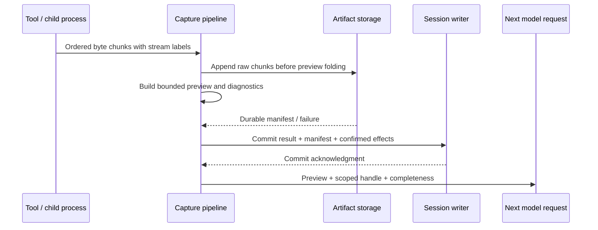

# 0276. Bounded Raw Artifact Capture and Durable Publication

- **Status:** Proposed
- **Date:** 2026-09-21
- **Last revised:** 2026-09-22 (proposal contract review)
- **Scope:** `muta-agent` (tool execution), `muta-contracts` (artifact protocol), `muta-persistence` (artifact store)
- **Deciders:** Project maintainers
- **Implementation:** Not implemented by this proposal
- **Evidence baseline:** Working tree at `9cd2b5de`. Source locations are code spans, not links.
- **Builds on:** [ADR-0264](0264-epistemic-stream-spooling-content-aware-projection-and-unified-inspect-architecture.md) (content-addressed spool), [ADR-0263](0263-axiom-of-linear-causality-and-pure-execution-primitives.md) (finite execution)
- **Amends:** the `SpillMiddleware` late-remedial-spill approach and the upstream pre-return folding in tool collectors
- **Sibling decisions:** [ADR-0275](0275-immutable-execution-facts-and-branch-local-context-views.md), [ADR-0277](0277-unified-context-planner-and-request-compiler.md), [ADR-0278](0278-compaction-as-a-view-commit.md), [ADR-0279](0279-scoped-inspect-retrieval-retention-and-deletion.md), [ADR-0280](0280-versioned-context-policy-and-clean-break-cutover.md)

## Context and Problem Statement

Tool output is the largest, least controllable input to context, and today Muta destroys it before anyone can decide its fate. The command collector folds and caps output at the source (`apply_caps_ex`) before the result is returned, so folding is irreversible at the point where a raw stream could still have been preserved. A later middleware (`SpillMiddleware`, post-execute) tries to rescue the bytes, but by then the upstream already discarded them: it can only spill a preview of an already-folded result.

There is also no defined durability contract. "Lossless" is asserted in prose while collection is in fact bounded by byte caps and folds, and no state distinguishes a complete capture from a truncated or interrupted one.

This decision makes raw capture an **entry-point, publish-before-reference** protocol: bytes are written to a content-addressed artifact store in chunks the moment they arrive, before any preview folding, and a reference is only committed as readable after the artifact is durably published.

## Current Implementation Evidence

| Location / symbol (code span) | Current observation | Required change |
|---|---|---|
| `crates/muta-agent/src/tools/execute_command/pipes.rs`, `OutputCollector::apply_caps_ex`, `fold_pure_green_runs` | When `!raw`, replaces runs of ≥3 pure-green test-pass lines with a folded marker, then applies byte/line caps — before the tool result is returned. | Raw bytes go to the artifact writer first; the preview consumes and folds them independently. |
| `crates/muta-agent/src/tools/execute_command/episodic.rs` | Calls `collector.apply_caps_ex(exit, raw)` on the pre-return path. | Capture precedes folding; the collector operates on the preview branch only. |
| `crates/muta-agent/src/execution/middleware/spill.rs`, `SpillMiddleware::post_execute` | Writes the received (already capped) output to `.muta/storage/spool/spool_<tool>_<ts>_<rand>.txt` and rewrites the output to head/tail + a notice; threshold default 50000 bytes. | Delete the late remedial spill; capture artifacts at the entry point so no bytes are lost upstream. |

## Decision Drivers

1. Raw tool output must be recoverable byte-for-byte, because a later question ("what exactly failed?") cannot be answered from a folded preview.
2. "Lossless projection" must not be confused with "unbounded collection"; finite execution, time limits, and storage quotas still apply.
3. A durability claim must be backed by a protocol, not by prose: no reference is readable before its artifact is durably published.
4. Every consumer (model preview, `inspect`, later summarization) must share one artifact language and one completeness vocabulary.

## Considered Options

| Option | Verdict |
|---|---|
| Keep late remedial spill (post-execute) on already-capped output | Rejected: the bytes are already gone; the middleware can only re-save a preview. |
| Stop folding entirely and inject full output | Rejected: violates the finite window and finite-execution budget; output is unbounded in principle. |
| Capture at the entry point, publish before reference, fold only the preview | Recommended: raw recoverability with explicit finite bounds. |

## Decision Outcome

### 1. Capture pipeline



1. Raw streams are written in chunks to the private runtime data directory and must not first pass through line truncation, ANSI stripping, or semantic folding. stdout and stderr keep their own byte order; across streams only the actual receive order is recorded, and no fabricated in-process global order is asserted.
2. The preview branch may strip ANSI, aggregate passing lines, and extract fragments around failures; it records the raw byte ranges, transformation version, and summary statistics.
3. The writer uses a bounded queue and backpressure, so a slow disk never becomes unbounded memory. Each command is bounded by time, per-process output artifact quota, and session storage quota.
4. On overrun, disk-write failure, or cancellation, stop local capture and request producer termination under a finite stop/drain policy; record whether termination was confirmed under [ADR-0275](0275-immutable-execution-facts-and-branch-local-context-views.md#8-execution-closure-and-late-evidence). A remote action may remain `OutcomeUnknown`. Record the durable captured prefix, whether the omitted range is known, and the stop reason. Future output that was never captured is not recoverable history.
5. Only after the chunks and manifest complete durable publication does the SQLite transaction commit a readable reference. Publication includes flushing and syncing file contents, atomic namespace publication, and syncing the containing directory or an equivalent supported storage durability primitive. A crash may leave an unreferenced blob, but never a dangling reference marked Complete. Unsupported durability guarantees are an explicit storage error, not a silent downgrade.
6. A failed artifact write must not report "the complete result was saved". If a side effect already occurred while the result commit failed, the system enters a recovery-required state and does not start the next turn.
7. Single-line minified files, binary content, non-UTF-8 data, and images all use the artifact protocol; text display uses bounded decoding and never indexes a `str` at an unknown byte offset.

SQLite transactions cover only modifications inside the database; external files need the publication protocol above. This design publishes a reclaimable orphan first and commits the reference afterwards, instead of pretending to have a cross-file transaction; for SQLite's atomic-commit guarantees see [Atomic Commit In SQLite](https://www.sqlite.org/atomiccommit.html).

### 2. Completeness vocabulary

Capture state is one of `Complete | Interrupted | Truncated(reason) | Unavailable(reason)` ([ADR-0275](0275-immutable-execution-facts-and-branch-local-context-views.md#3-orthogonal-lifecycle-axes) §3). A truncated artifact reports the retained prefix and whether the omitted range is known; a consumer must never infer completeness from the mere existence of a handle.

### 3. Authorization split between preview and raw artifact

Tool-result display and raw-artifact authorization may differ: existing secret-scrub rules apply to the model-visible preview, while a raw artifact inherits the correspondingly stricter access policy and cannot be reached around it through `inspect` ([ADR-0279](0279-scoped-inspect-retrieval-retention-and-deletion.md)). Raw secrets must never be used as log or telemetry fields.

### 4. Publication ownership and garbage collection

Publication state is separate from capture completeness and deletion:

```text
Capturing -> PublishedPendingReference -> Referenced
     \                 \-> Orphaned -> Reclaimed
      \-> Abandoned -> Reclaimed
```

Before writing, the canonical writer grants a scoped publication lease and reserves quota. The lease owns a publication ID, storage generation, finite expiry, and intended execution/scope. It protects staging chunks and published-but-unreferenced material from GC. Content-addressed deduplication does not bypass authorization, logical quota accounting, or this protection. Concurrent producers reserve against both session and global limits atomically; a pending capture cannot oversubscribe the store by racing another producer.

Publishing a manifest does not make a handle readable. The result/reference transaction validates the publication lease, durable manifest, scope authorization, and execution acceptance generation, then atomically installs references, converts reserved capacity into committed usage, and releases unused reservation capacity and the publication lease. A late result follows ADR-0275's reconciliation transaction instead of committing into a closed group. Lease expiry or revocation fences the old publisher: it cannot attach a reference after GC has acquired reclaim ownership. Renewal and reference acquisition serialize with reclaim ownership, and no network or artifact-file I/O wait holds the session writer.

After a crash, recovery reconciles publication records with staged/published files and committed references. An orphan is reclaimable only after its publisher has been fenced and no reference or valid lease protects it. A transaction retry uses the same idempotent publication/operation identity; it does not duplicate an execution result. Incomplete but durable captured bytes may be referenced with their actual completeness state. Failed or missing material is never promoted to Complete. ADR-0279 owns retention and collection after reference installation.

Failed capture releases unused reservations; staged and orphaned bytes remain charged to global occupancy until physically reclaimed. Expiry of a lease does not itself free disk capacity. A bounded emergency diagnostic buffer may preserve the failure reason, but it cannot impersonate a durable raw artifact or bypass the secret-scrub policy.

## Invariants & Behavioral Boundaries

- **`[INV-CAP-01]` Durable Before Complete**: An artifact is durably persisted (`flush`/`fsync` + atomic publication) before any reference is committed as readable; an unrecoverable artifact reports its true incomplete state and no reference is ever left dangling as Complete. (Verification: byte-for-byte retrieval and I/O fault injection at each step.)
- **`[INV-CAP-02]` Capture Fidelity**: Raw streams are captured byte-exact before any folding, ANSI stripping, or truncation; stdout/stderr keep their own order and cross-stream order is only the actual receive order. (Verification: mixed-stream, ANSI, and non-UTF-8 fixtures compared byte-for-byte.)
- **`[INV-CAP-03]` Finite Capture Bounds**: Capture is bounded by time, per-execution bytes, chunk/queue capacity, and session quota; exceeding any bound yields a finite stop plus an explicit `Truncated`/`Interrupted` state, never silent discard or unbounded memory. (Verification: overrun, slow-disk, and full-disk tests.)
- **`[INV-CAP-04]` Typed Binary and Text Handling**: Binary, non-UTF-8, minified, and image payloads use the artifact protocol; text rendering uses bounded decoding and never slices `str` at an unknown byte offset. (Verification: over-long single-line and invalid-UTF-8 fixtures.)
- **`[INV-CAP-05]` Publication Ownership**: Every in-progress publication is protected by a scoped, expiring, fenced lease; attaching references and releasing its reservation are atomic. GC cannot reclaim material while a valid publisher can still reference it, and an expired publisher cannot resurrect reclaimed content. (Verification: GC between publication and reference commit, lease-expiry/renewal races, deduplicated concurrent publication, and crash recovery.)
- **`[INV-CAP-06]` Reserved Quotas**: Concurrent captures reserve logical session bytes and global storage capacity before consumption; quota exhaustion is finite and explicit, and released reservations cannot leak across crashes. (Verification: concurrent captures at quota, abandoned staging, and full-disk recovery.)

## Positive Consequences

The model preview stays bounded while a complete, addressable original remains available for retrieval, diagnostics, and later summarization. Folding becomes a presentation choice over a preserved original rather than an irreversible loss. The publication protocol gives a single durability contract that all consumers share.

## Negative Consequences & Trade-offs

Chunked write-ahead capture adds I/O and a small latency cost per command; bounded queues and batched flushes mitigate it, but acknowledged durability is never traded away for latency. Storing raw bytes costs disk; quotas and content-addressed deduplication bound it, and retention policy ([ADR-0279](0279-scoped-inspect-retrieval-retention-and-deletion.md)) governs how long it lives.

## Rejected Alternatives & Negative Knowledge

### Late remedial spill of already-capped output

Tried and insufficient: `SpillMiddleware` runs after the collector has folded and capped, so it can only persist a truncated preview. Remediation must happen where the bytes still exist.

### Collecting every unreferenced blob immediately

A durably published artifact can legitimately have no committed reference yet. A time delay alone is not synchronization; a fenced publication lease protects the interval and defines when an abandoned publisher loses the right to attach a reference.

### "Just keep everything in the prompt"

Cannot fit a finite window; and it removes no bytes from the wire, so it does not solve recoverability at all.

### Upstream line truncation or ANSI stripping before capture

Destroys exactly the evidence a later diagnosis needs and makes completeness unverifiable. Clean the preview, not the original.

## Links

- Sibling decisions: [ADR-0275](0275-immutable-execution-facts-and-branch-local-context-views.md), [ADR-0277](0277-unified-context-planner-and-request-compiler.md), [ADR-0279](0279-scoped-inspect-retrieval-retention-and-deletion.md)
- Related records: [ADR-0263](0263-axiom-of-linear-causality-and-pure-execution-primitives.md), [ADR-0264](0264-epistemic-stream-spooling-content-aware-projection-and-unified-inspect-architecture.md)
- External reference: [Atomic Commit In SQLite](https://www.sqlite.org/atomiccommit.html)
