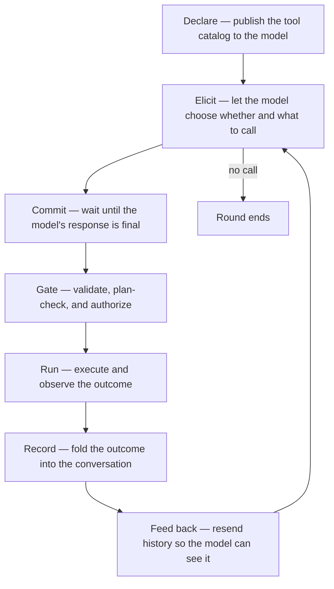

# Rounds and turns

muta executes a request in two nested layers. A **round** is the unit the
user perceives: one admitted message, one final reply. A **turn** is one
iteration of the ReAct loop inside that round: one model request, plus the tool
work that follows when the model asks for it. One round contains one or many
turns; one turn never spans rounds.

The split is not decorative. Different concerns attach to each layer, and
keeping them straight is the key to reading the rest of the canon. For the
control plane that drives a round, see [Harness architecture](harness.md).

## The two layers

```text
round ───────────────────────────────────────────────┐
  │                                                   │
  ├── turn 1: model request → tool call → result ───┐ │
  ├── turn 2: model request → tool call → result ───┤ │
  ├── turn 3: model request → tool call → result ───┤ │
  └── turn N: model request → final text (no call)  │ │
                                                    │ │
  round ends ─────────────────────────────────────┘ │
                                                     │
next round ─────────────────────────────────────────┘
```

A **round** opens after the `UserPromptSubmit` admission hook accepts a
submitted message and closes when the agent produces a final assistant
message that carries no tool call. A denied prompt opens no round. Everything
between — every model request, every tool execution, every result folded back
into the transcript — belongs to that one round.

A **turn** is one pass through that loop: send the conversation to the
model, let the response commit, and either execute the tool calls it
carries (then loop) or treat it as the round's answer (then stop). A
trivial round that needs no tools is a single turn. A round that reads,
edits, and verifies may run several.

The turn counter resets at the start of every round. A separate, monotonic
**round counter** persists across rounds for concerns that measure
user-visible exchanges — plan staleness and transcript provenance.

## Terminology note

Earlier revisions used the opposite labels. [ADR-0047](../../adr/0047-round-contains-turn-vocabulary.md)
established the current convention: **round** is the complete conversational
exchange and **turn** is one model/tool move inside it. Current control-plane
symbols (`execute_round`, `RoundEvent`, `TurnStarted`) and the activity detail
line (`round N · turn M · <model>`) follow that mapping. Historical ADRs retain
the vocabulary they used when written.

## What ends a round

A round stops on the first of these conditions:

| Condition | Kind | What the user sees |
|-----------|------|--------------------|
| Final assistant message with no tool call | Natural completion | The reply |
| Repeated-call guard trips | Stuck loop | An error |
| User interrupt or supersession | Cancellation | The round stops where it is |
| Terminal harness error | Abort | An error or denied/cancelled result |

There is **no default per-round turn cap**: distinct tool calls are allowed to
run
uncapped, matching the codex / claude-code agentic-loop model (ADR-0009).
Context projection is the backstop that keeps long rounds within the model
window; the user can interrupt at any time. An optional doom-loop guard can
block repeated watched signatures, and an explicit `hard_stop_turns` setting
can impose a user-chosen bound.

For the rest of the safety surface, see [Harness architecture](harness.md).

## What ends a turn

A turn's provider phase commits when the stream terminates and the assistant
message is final. Up to that boundary, nothing with side effects has run and
the provider request is still retryable. After commit, the harness executes
and records any carried tool calls; that completes the turn and starts the
next one. A committed message with no call ends both the turn and the round.

The sections below open up the lifecycle inside a single turn:
declaration, gating, execution, and how the outcome re-enters the
transcript.

## The turn, as a concept

A tool call is a round trip between a stateless model and an agent that
owns the conversation. The model proposes a call; the agent shapes it,
gates it, runs it, and folds the outcome back into the conversation so
the next turn can see it.



The loop closes on the transcript. Every stage either reads from it or
appends to it, and the model's only view of a prior turn is what the
transcript says. The sections below are about why each stage behaves the
way it does. For the wire-level mechanics — HTTP transaction shape, SSE
delta reassembly, the ReAct loop — see [Request flow](../request-flow.md).
For why providers differ, see [Provider capabilities](../provider-capabilities.md).

## The transcript is the only memory

The model has no state between requests. Everything it "knows" about a
prior tool call is the message history it receives each turn, so the
agent resends the full history on every request and treats the
transcript as append-mostly. It is never edited to change meaning.

The catalog is just as ephemeral to the runtime. The tool list is
republished on every request — including the turn that carries results
back — because the serving runtime keeps no tool state across turns.
Selection stays automatic: the agent never forces a call; the model
chooses whether and which.

The one disciplined exception to "never edit" is **repair at the
boundary**, and it exists only to keep an append-only history valid
against the wire contract:

- **Attribution.** When a provider has no native function calling, a
  call arrives as plain assistant text. The runtime, however, still
  requires every result message to reference a preceding call. The agent
  satisfies that by attributing the parsed call to the assistant message
  that produced it — and only when that message carries no real native
  call, so a genuine call is never overwritten.
- **Pruning.** Restored or forked sessions can carry results whose
  originating calls were filtered out — hidden harness prompts, a fork
  across code paths. Rather than rewrite history, the agent drops
  unmatched results at the request boundary, so a stale session cannot
  violate the contract.

Both repairs share one principle: history is mended just enough to
satisfy the wire contract, never rearranged to change what happened.

## One registry, two protocols

Tool capability is uneven across providers. Some runtimes accept a
native tool-call field and return structured calls; others speak only
text. muta answers that with a single tool registry behind two wire
protocols that mean the same thing:

- **Native** — the runtime carries calls in its own structure; streamed
  fragments are reassembled, and nothing executes until the response
  terminates.
- **Fallback** — the model is instructed to emit a call as ordinary
  text, and the agent extracts it after the response completes.

The two paths share one dispatch contract, one permission broker, one
result format, and one loop. Choosing a protocol changes the transport,
not the semantics — which is why a provider without native support is
still fully usable rather than a degraded mode.

Fallback parsing is intentionally strict. The agent looks for a single
top-level object that names a tool and its arguments, and parses the
whole string. It does not trim code fences or scan prose for embedded
calls. The model is *told* to emit the raw object; heuristic rescue
would risk false positives on ordinary text and mask the real failure —
a model that ignored the instruction. A malformed call simply fails to
parse, and the round ends without an invocation.

Because a fallback call is rendered live as assistant text while it
streams, the agent withdraws it from the visible buffer once it parses,
before drawing the tool step. The native path needs no such withdrawal:
its call deltas never enter the visible text buffer at all.

## Commit before any side effect

Tool side effects are irreversible; provider requests are retryable.
That asymmetry is the whole reason execution is deferred: nothing fires
until the turn is *committed* — meaning the model's response has fully
arrived. A stream that errors before completion can be retried without
leaving partial tool state behind.

The corollary, once anything has executed, is that retryable errors
become terminal. Replaying a request after a side effect would risk
running that side effect a second time, so the agent refuses to retry
once the first tool has fired. The boundary between "retry freely" and
"no retry" is exactly that first execution.

## Gates run before execution

Every call crosses the same gating stack before it runs, and the whole
stack sits behind one convergence point so that the native and fallback
paths — and any future tool source — pass through identical checks:

1. **Lookup.** An unknown name returns an error *result*, not an abort.
   The model sees the error and can recover; a typo is not a
   round-ending failure.
2. **Write-scope gate.** A per-agent `WriteScope` boundary filters write tools
   whose target is outside the agent's granted paths — the main agent is
   unrestricted, an envoy is scoped by its profile. In-scope calls pass; an
   out-of-scope call is routed to the broker for the user to approve (or block
   outright under autopilot, where no human can answer). See
   [ADR-0028](../../adr/0028-capability-allocation-scoped-writes.md).
3. **Permission broker.** Write-capable calls are authorized against a
   scoped rule set. A cached *always* rule skips the prompt; otherwise
   the call waits for a decision, and a denial comes back as a result
   that tells the model not to retry. See
   [Harness architecture](harness.md).

Order is load-bearing: a call is validated, plan-checked, and authorized
before it is allowed to do anything. The model never learns which gate
opened or blocked — it only sees the result.

## The model consumes text

Whatever a tool produces, the model only ever reads text. So a result is
deliberately split into two faces:

- a **typed payload**, forwarded to the UI so it can render a shell
  transcript, a code block, a file listing, or a patch faithfully; and
- a **flattened text string**, appended to the transcript, which is all
  the model will see on the next turn.

Splitting the two keeps the UI rich without lying to the model: the
transcript carries exactly the text a tool chose to expose, and the UI
carries the structure that text was derived from. Terminal status —
success versus failure — is read from the typed payload, not sniffed
from the text, so a non-zero shell exit is a real failure rather than
something that has to be recognized by an `Error` prefix. For the
decision history behind this split, see
[ADR-0001](../../adr/0001-tool-rendering-redesign.md).

A related split lives in identifiers. The wire requires a result to
reference the call id the runtime issued; the UI wants stable steps
even when a runtime omits ids or emits duplicates. So the wire id and
the UI id are separate namespaces: one satisfies the protocol, the other
keeps the display stable.

## Why two layers

The layers exist because concerns attach to different boundaries. A round is
the right scope for user intent, cancellation ownership, and the durable
conversation. A turn is the right scope for provider retry safety, tool
dispatch, context pressure, and loop diagnostics.

| Concern | Layer | Why it lives there |
|---------|-------|--------------------|
| Admission and cancellation ownership | Round | One submitted request owns one cancellable execution |
| Provider retry safety | Turn | A provider attempt is retryable only before a committed side effect |
| Context projection | Turn boundary | Tool results may be pruned or compacted before the next model request |
| Session review / optional hard stop | Turn sequence within a round | These policies observe progress through the ReAct loop |
| Transcript durability | Both | Admission persists the round input; tool and continuation boundaries are mid-round save points; terminal commit closes the round |

The rule of thumb: if a concern belongs to the user's request, it is
round-scoped; if it watches one model/tool pass, it is turn-scoped.

## How the layers show up

While a round runs, the activity surface reports both layers as
`round N · turn M · <status>`. Each tool call renders as a step. When the
round ends, the live turn detail collapses into the user-visible exchange.
Durable mid-round save points mean a resumed session may recover committed
tool work without pretending the interrupted round reached a normal answer.

An envoy runs its own round with its own independent turn sequence; the
parent's turn is parked while the child works. See [Envoys](envoys.md).

## A round of several turns

A user asks: *fix the bug in `parser.rs` and explain the fix*. One round,
four turns:

```text
round opens
  turn 1  read_text(parser.rs)   ← model inspects
  turn 2  edit_file(parser.rs)   ← model applies the fix
  turn 3  read_text(parser.rs)   ← model verifies the result
  turn 4  "The bug was …"        ← final text, no tool call
round ends
```

Each turn sends the full, growing transcript back to the model; the
conversational memory is the transcript the agent resends, not anything
the model remembers. If the transcript grows past the context budget
mid-round, relief prunes old tool results between turns — the round does not
have to end to reclaim space. When turn 4 produces plain text with no tool
call, the round closes.

## See also

- [Harness architecture](harness.md) — round execution, retry, and the
  full table of safety bounds
- [Request flow](../request-flow.md) — HTTP shape, SSE reassembly, the
  ReAct loop
- [Built-in tools](../../reference/tools/index.md) — the catalog that
  gets declared
- [Provider capabilities](../provider-capabilities.md) — why the protocol
  splits in two (native vs fallback)
- [Guided decoding](../guided-decoding.md) — the constrained-decoding
  layer that produces valid native calls
- [Envoys](envoys.md) — independent child rounds and turn sequences
  for child agents
- [How to add a tool](../../how-to/add-a-tool.md) — adding a new tool
